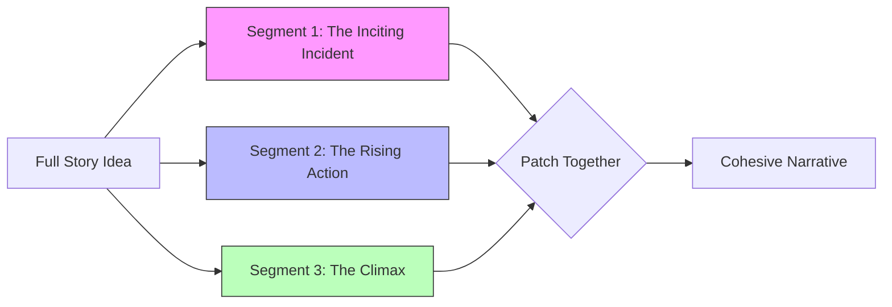

# 🏗️ Handling Large Tasks

When users first start with SammyAI, the temptation is often to ask for everything at once: *"Write me a full 5,000-word chapter about an interstellar heist."* However, Large Language Models (LLMs) are at their most creative and coherent when they work in focused, modular bursts. 

By breaking your project into segments, you avoid "creative drift" and ensure every piece of your narrative is intentional and high-quality.

---

## 🧩 The Modularity Principle

The best way to write a massive story is to build it one "patch" at a time. LLMs are remarkably good at seamlessly connecting smaller pieces of text into a cohesive whole, provided you guide them through the transitions.

---

## 📉 Understanding "Creative Drift"

Why does the AI lose its way during massive generations? It comes down to the nature of how LLMs work.

*   **Prediction vs. Intent**: LLMs predict the "next most likely word." Over a long sequence, the model can begin to drift away from your original intent and start generating text based on the patterns *it* just created, rather than the instructions *you* gave at the start.
*   **The "Wall of Text" Trap**: Without new prompts to steer it, the AI can become repetitive, overly verbose, or introduce irrelevant plot points just to keep the sequence going.

> [!IMPORTANT]
> **Steer the Ship**
> Large tasks require constant course correction. Each new prompt you provide acts as a "reset" for the AI's intent, snapping it back to your specific creative goals.

---

## 🆚 Modular vs. Massive

| Feature | The "Massive" Request | The "Modular" Approach |
| :--- | :--- | :--- |
| **Request** | "Write the whole story." | "Write the opening scene." |
| **Control** | Very low. The AI decides everything. | Very high. You approve each step. |
| **Quality** | Unpredictable / Verbose. | Precise / Coherent. |
| **Structure** | Often weak or repetitive. | Robust and well-paced. |

---

## 🛠️ Step-by-Step Workflow

1.  **Draft an Outline**: Use the **Multi-Modal Chat** to brainstorm a high-level structure.
2.  **Zero In**: Focus on a single scene or even a single interaction within a scene.
3.  **Refine & Patch**: Once a segment is finished (and perhaps polished via **Diff-Edits**), move to the next.
4.  **Connect**: Tell SammyAI: *"Previously, Sarah found the map. Now, let’s write the scene where she tries to decode it in the library."*

> [!TIP]
> **Use CIN for Bridges**
> If you're moving between major segments, place a summary of the *previous* segment into the **CIN (Context Injection)** tab. This provides the AI with a "bridge" to ensure the tone and facts remain consistent in the new task.
